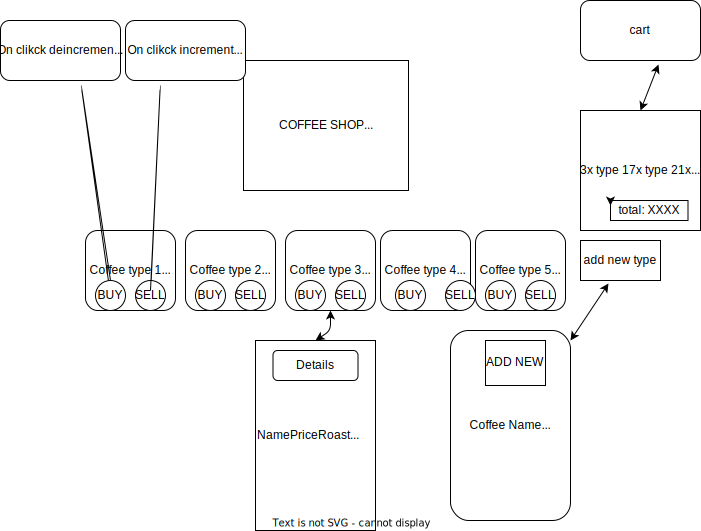

# Coffee Shop
## Local Business Inventory Tracker

#### By Gabriel Tucker

## Component Diagram
 

## Technologies Used

* Html
* Javascript, ES6
* CSS
* React
* npm 
* ESLint
* uuid
* Git
* vite

## Setup/Installation Requirements

1. go to my github repository for the project (https://github.com/gabe9t/projectweek8)

2. Click the 'code' button and copy the url for HTTPS.

3. Open Bash and type: <b>`git clone https://github.com/Gabe9T/projectweek8.git`<b>

4. Open cloned file in VsCode

5. to run the Project site Type these commands into terminal: `npm install`, `npm run dev`, `o + enter`

## Known Bugs
* None as of now.

## link to old repo
Problems while pushing, messed up code
will figure out how to fix it later this week, 
project is buggy.
(https://github.com/gabe9t/projectweek82)

## License
MIT License. See license.md for further information
